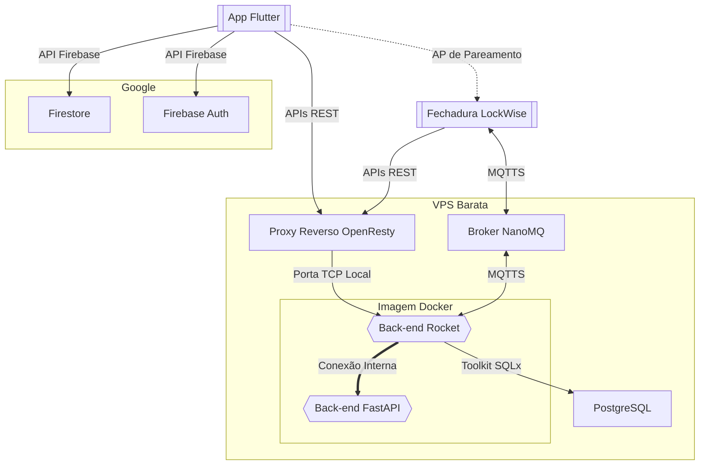

# Desenvolvimento do Back-End

## Introdução

Inicialmente, planejávamos não escrever um *back-end*, mas usar o
[Firebase](https://firebase.google.com/) para toda a comunicação remota entre
o aplicativo e o dispositivo, usando as funcionalidades integradas da
plataforma para comunicação via MQTT. Infelizmente, com a deprecação do serviço
de reconhecimento de voz que originalmente planejamos usar, ficou claro que
teríamos que implementar um *back-end*, nem que mínimo, para calcular os
[*embeddings* ECAPA-TDNN](https://arxiv.org/abs/2104.01466) que usaríamos
para fazer a diarização da voz — como descrevemos abaixo — e, assim,
identificar sem ambiguidade quem é o locutor. O plano seguinte, então, era
fazer um único componente para o *back-end:* um serviço simples em Python,
usando [SpeechBrain](https://speechbrain.github.io/) e alguma framework web
leve, para controlar tanto o reconhecimento de voz quanto as funcionalidades do
aplicativo que exigissem mais segurança que o plano gratuito do Firebase é
capaz de providenciar. Eventualmente, essa ideia foi descartada pela
dificuldade que teríamos de dividir as tarefas, e pela dificuldade de escrever
um *back-end* robusto e com desempenho decente nessa linguagem — decidimos
dividir o *back-end* em dois serviços: um *back-end “principal”*, e um serviço
isolado em Python para a diarização:



Outros componentes constituem a arquitetura final do *back-end*. No diagrama
acima, temos todos os serviços usados no depoimento final: o aplicativo se
comunica ao Firebase e ao back-end; a fechadura se comunica com o broker e com
o back-end; o back-end se comunica internamente na imagem, e se comunica com o
banco de dados; um proxy reverso *[OpenResty](https://openresty.org/en/)* ou
*[Nginx](https://nginx.org/en/)* providencia TLS.


##  Serviço [Rocket](https://rocket.rs/) (Back-End Principal)

### Visão Geral

Este é o componente que coordena a comunicação entre todos os outros: ele
publica nos tópicos de controle MQTT dos dispositivos, monitora seus tópicos de
estado, se comunica com o banco de dados
[PostgreSQL](https://www.postgresql.org/), processa as requisições do
aplicativo, e recebe as amostras de áudio dos dispositivos e as transfere ao
serviço de *Speaker Recognition*. Todas as requisições que exigem segurança e
validação ocorrem aqui: este é o coração do projeto.

### Detalhes de Implementação

## Serviço [FastAPI](https://fastapi.tiangolo.com/) (*SpeechBrain*)

### Visão Geral

#### Escolha da Stack

A solução implementada utiliza Python como linguagem de programação principal,
combinada com as bibliotecas [PyTorch](https://pytorch.org/) e
[SpeechBrain](https://speechbrain.github.io/). Esta escolha se justifica por
diversos fatores técnicos e práticos. O Python oferece um ecossistema maduro e
bem estabelecido para aplicações de aprendizado de máquina, com ampla
documentação e suporte da comunidade. O PyTorch, por sua vez, representa o
estado da arte em frameworks de aprendizado profundo, e proporciona
flexibilidade na manipulação de tensores e operações em GPU quando necessário.
A biblioteca SpeechBrain foi selecionada especificamente por fornecer modelos
pré-treinados de alta qualidade para tarefas de processamento de áudio e fala,
eliminando a necessidade de treinamento do zero e garantindo resultados
consistentes e academicamente validados.

#### Modelo Utilizado

O modelo escolhido foi o
[`spkrec-ecapa-voxceleb`](https://huggingface.co/speechbrain/spkrec-ecapa-voxceleb)
disponibilizado pelo SpeechBrain. Trata-se de uma implementação da arquitetura
[ECAPA-TDNN *(Emphasized Channel Attention, Propagation and Aggregation in
Time Delay Neural Network)*](https://arxiv.org/abs/2104.01466), treinada na
base de dados [VoxCeleb](https://www.robots.ox.ac.uk/~vgg/data/voxceleb/),
que contém milhares de horas de gravações de fala de diversos locutores em
condições variadas. A seleção deste modelo se fundamenta em seu desempenho
comprovado em tarefas de verificação e identificação de locutor, com taxa de
erro significativamente reduzida em comparação com arquiteturas anteriores. A
arquitetura ECAPA-TDNN incorpora mecanismos de atenção que permitem ao modelo
focar nas características mais discriminativas da voz, resultando em
*embeddings* mais robustos e distintivos para cada locutor.

#### Funcionamento do Modelo

O modelo opera transformando amostras de áudio bruto em representações
vetoriais de dimensão fixa. O processamento inicia com a conversão do áudio PCM
de 16 bits em formato de waveform normalizado, seguido de reamostragem para
16kHz quando necessário, frequência na qual o modelo foi treinado. A
arquitetura ECAPA-TDNN processa então este sinal através de múltiplas camadas
convolucionais temporais (TDNN), que extraem características acústicas em
diferentes escalas temporais. Os blocos de atenção de canal enfatizam as
características mais relevantes para identificação do locutor, enquanto camadas
de pooling estatístico agregam informações ao longo de toda a duração do áudio.
O resultado final é um vetor de *embedding* de 192 dimensões que encapsula as
características biométricas vocais únicas do locutor. Este vetor é normalizado
para ter norma unitária, garantindo que comparações posteriores se baseiem
exclusivamente na direção do vetor no espaço de características, não em sua
magnitude.

#### Armazenamento e Comparação de *Embeddings*

Os vetores de 192 dimensões gerados pelo modelo são serializados em formato
*base64* para transmissão eficiente. Esta representação compacta permite que os
*embeddings* sejam facilmente transmitidos por APIs REST. Para a tarefa de
verificação de locutor, o sistema calcula a similaridade de cossenos entre o
*embedding* da amostra de teste e os *embeddings* armazenados dos locutores
conhecidos. A similaridade de cossenos mede o ângulo entre dois vetores no
espaço de 192 dimensões, produzindo um valor entre −1 e 1, onde valores
próximos a 1 indicam alta similaridade entre as vozes. Devido à normalização
dos *embeddings*, esta métrica se torna equivalente ao produto escalar entre os
vetores, o que constitui uma implementação computacionalmente eficiente. O
locutor identificado é aquele cujo *embedding* armazenado apresenta a maior
similaridade com a amostra de teste, com o valor de score fornecendo uma medida
de confiança na identificação.

### Detalhes de Implementação

O serviço SpeechBrain é implementado como uma aplicação FastAPI que expõe
endpoints REST para processamento de áudio e reconhecimento de voz. A
implementação é estruturada em seções bem definidas, cada uma com
responsabilidades específicas.

#### Configuração do Modelo

```py
MODEL_SOURCE = "speechbrain/spkrec-ecapa-voxceleb"
MODEL_DIR = "models/spkrec"

EXPECTED_SR = 44100
MODEL_SR = 16000
MIN_SECONDS = 2.0
```

- `MODEL_SOURCE`: Especifica o identificador do modelo pré-treinado no [Hugging
Face](https://huggingface.co/).
- `MODEL_DIR`: Diretório local onde o modelo será armazenado após o download
inicial.
- `EXPECTED_SR`: Taxa de amostragem esperada dos dados de áudio de entrada
(44.1kHz), usada no cadastro de voz do *app* e na gravação do dispositivo.
- `MODEL_SR`: Taxa de amostragem para a qual o modelo foi treinado (16kHz),
para reamostragem, quando necessário.
- `MIN_SECONDS`: Duração mínima de áudio necessária para extração confiável de
*embedding* (2 segundos).

#### Carregamento do Modelo

```py
try:
    print("DEBUG: Loading SpeechBrain model")
    from speechbrain.utils.fetching import LocalStrategy

    spkrec = SpeakerRecognition.from_hparams(
        source=MODEL_SOURCE,
        savedir=MODEL_DIR,
        run_opts={"device": "cpu"},
        local_strategy=LocalStrategy.NO_LINK,
    )
    print("DEBUG: SpeechBrain model loaded successfully")
except Exception as e:
    print(f"DEBUG: Failed to load SpeechBrain model: {e}")
    exit(1)

resampler = torchaudio.transforms.Resample(orig_freq=EXPECTED_SR, new_freq=MODEL_SR)
```

O carregamento do modelo é realizado uma única vez na inicialização do serviço:

- `LocalStrategy.NO_LINK`: Estratégia de download que evita usar links
simbólicos (atalhos de arquivo) para salvar os modelos, o que facilita
incluí-los na imagem [Docker](https://www.docker.com/).
- `run_opts={"device": "cpu"}`: Força execução em CPU, já que nosso VPS não
conta com GPU, e que o SpeechBrain em si não se beneficia tanto de GPU
discreta.
- `SpeakerRecognition.from_hparams()`: Carrega o modelo pré-treinado com todos
os hiperparâmetros predeterminados.
- `torchaudio.transforms.Resample`: Cria um objeto de reamostragem para
converter áudio de 44.1kHz para 16kHz quando necessário.

#### Funções Utilitárias

##### Conversão de Áudio PCM

```py
def pcm16_to_waveform(pcm_bytes: bytes) -> torch.Tensor:
    samples = np.frombuffer(pcm_bytes, dtype=np.int16)
    if samples.size == 0:
        raise ValueError("Empty audio buffer")

    waveform = samples.astype(np.float32) / 32768.0
    waveform = torch.from_numpy(waveform).unsqueeze(0)
    return waveform
```

Esta função converte dados de áudio bruto em formato adequado para processamento pelo modelo:

- `np.frombuffer(pcm_bytes, dtype=np.int16)`: Interpreta os bytes como amostras
de 16 bits *signed*, formato padrão PCM.
- `astype(np.float32) / 32768.0`: Normaliza os valores para o intervalo `[-1,
1]`, esperado pelo PyTorch e modelos de deep learning.
- `torch.from_numpy()`: Converte para tensor PyTorch.
- `unsqueeze(0)`: Adiciona dimensão de batch, necessária para processamento em
lote pelo modelo (mesmo para áudio single-channel).

##### Extração de Embedding

```py
def extract_embedding(pcm_bytes: bytes) -> np.ndarray:
    waveform = pcm16_to_waveform(pcm_bytes)
    if EXPECTED_SR != MODEL_SR:
        waveform = resampler(waveform)

    min_samples = int(MIN_SECONDS * MODEL_SR)
    if waveform.shape[1] < min_samples:
        raise ValueError("Audio too short")

    with torch.no_grad():
        emb = spkrec.encode_batch(waveform)

    emb = emb.squeeze(0).cpu().numpy()
    emb /= np.linalg.norm(emb)
    return emb.astype(np.float32)
```

Função central que transforma áudio em representação vetorial:

- `resampler(waveform)`: Reamostra para 16kHz quando necessário.
- `min_samples`: Calcula número mínimo de amostras baseado em duração e taxa de
amostragem, para que haja dados suficientes.
- `torch.no_grad()`: Desabilita cálculo de gradientes durante inferência,
que não são necessários.
- `spkrec.encode_batch()`: Executa inferência no modelo, extraindo
características acústicas em 192 dimensões.
- `squeeze(0)`: Remove dimensão de batch desnecessária no resultado.
- `cpu().numpy()`: Move tensor da GPU (se estiver) para a CPU, e converte para
um *array* do NumPy.
- `emb /= np.linalg.norm(emb)`: Normaliza o vetor para norma unitária.

##### Serialização de Embeddings

```py
def serialize_embedding(emb: np.ndarray) -> str:
    return base64.b64encode(emb.tobytes()).decode("ascii")
```

- `emb.tobytes()`: Converte array NumPy em bytes brutos, mantendo a precisão de
32 bits.
- `base64.b64encode()`: Codifica em *base64* para transmissão segura pela API
REST.
- `.decode("ascii")`: Converte bytes *base64* para string ASCII, compatível com
APIs REST.

##### Desserialização de Embeddings

```py
def deserialize_embedding(data: str) -> np.ndarray:
    try:
        raw = base64.b64decode(data)
        print(f"DEBUG: Decoded {len(raw)} bytes from base64")
        emb = np.frombuffer(raw, dtype=np.float32).copy()  # Make a writable copy
        print(f"DEBUG: Created array with shape {emb.shape}")
        norm = np.linalg.norm(emb)
        print(f"DEBUG: Norm is {norm}")
        if norm > 0:
            emb /= norm
        else:
            print("DEBUG: Warning - norm is zero or negative")
        return emb
    except Exception as e:
        print(f"DEBUG: Error in deserialize_embedding: {e}")
        raise
```

Processo inverso da serialização:

- `base64.b64decode()`: Decodifica string *base64* de volta para bytes.
- `np.frombuffer(raw, dtype=np.float32)`: Reconstrói array NumPy com precisão
correta.
- `.copy()`: Cria cópia writable, pra evitar múltiplas referências ao mesmo
objeto.
- Verificação de norma e renormalização: tenta garantir consistência mesmo se
alguns dados foram corrompidos durante transmissão.

##### Cálculo de Similaridade

```py
def cosine_similarity(a: np.ndarray, b: np.ndarray) -> float:
    return float(np.dot(a, b))
```

- `np.dot(a, b)`: Calcula produto escalar entre vetores normalizados, equivalente à similaridade de cossenos devido à norma unitária.
- `float()`: Converte resultado NumPy para tipo Python nativo para serialização JSON.

#### Modelos de API

```py
class EmbedRequest(BaseModel):
    pcm_base64: str

class EmbedResponse(BaseModel):
    embedding: str

class VerifyRequest(BaseModel):
    pcm_base64: str
    candidates: list[str]

class VerifyResponse(BaseModel):
    best_index: int
    score: float
```

Classes [Pydantic](https://docs.pydantic.dev/latest/) definem contratos de API:

- `EmbedRequest`: Estrutura para requisições de extração de embedding, contendo
áudio codificado em *base64*.
- `EmbedResponse`: Resposta com embedding serializado para armazenamento.
- `VerifyRequest`: Dados para verificação de voz, incluindo áudio de teste e
lista de embeddings candidatos.
- `VerifyResponse`: Resultado da verificação com índice do melhor match e score
de confiança.

#### Aplicação FastAPI

```py
app = FastAPI()
```

Instancia aplicação [FastAPI](https://fastapi.tiangolo.com/), framework web
assíncrona otimizada para APIs REST com validação automática via
[Pydantic](https://docs.pydantic.dev/latest/).

##### Endpoint de Extração de Embedding

```py
@app.post("/embed", response_model=EmbedResponse)
def embed(req: EmbedRequest):
    try:
        pcm = base64.b64decode(req.pcm_bytes)
        emb = extract_embedding(pcm)
        return EmbedResponse(embedding=serialize_embedding(emb))
    except Exception as e:
        raise HTTPException(status_code=400, detail=str(e))
```

- `@app.post("/embed")`: Define rota POST para extração de embedding.
- `response_model=EmbedResponse`: Validação automática da resposta.
- Decodifica áudio, extrai embedding, serializa e retorna, convertendo exceções
em respostas HTTP 400 com detalhes.

##### Endpoint de Verificação de Voz

```py
@app.post("/verify", response_model=VerifyResponse)
def verify(req: VerifyRequest):
    try:
        print(f"DEBUG: Verify request with {len(req.candidates)} candidates")
        pcm = base64.b64decode(req.pcm_base64)
        print(f"DEBUG: Decoded {len(pcm)} bytes of audio data")

        if os.getenv("DEBUG_PLAY_AUDIO"):
            print("DEBUG: Playing audio sample")
            with tempfile.NamedTemporaryFile(suffix=".pcm", delete=False) as f:
                f.write(pcm)
                temp_file = f.name
            try:
                subprocess.run(
                    [
                        "mpv",
                        "--no-config",
                        "--demuxer=rawaudio",
                        "--demuxer-rawaudio-format=s16le",
                        "--demuxer-rawaudio-channels=1",
                        "--demuxer-rawaudio-rate=44100",
                        temp_file,
                    ],
                    check=True,
                )
            except subprocess.CalledProcessError as e:
                print(f"DEBUG: Failed to play audio: {e}")
            finally:
                os.unlink(temp_file)

        test_emb = extract_embedding(pcm)
        print(f"DEBUG: Extracted test embedding with shape {test_emb.shape}")

        best_score = -1.0
        best_idx = -1

        for i, cand in enumerate(req.candidates):
            print(f"DEBUG: Processing candidate {i}")
            emb = deserialize_embedding(cand)
            print(f"DEBUG: Deserialized candidate embedding with shape {emb.shape}")
            score = cosine_similarity(test_emb, emb)
            print(f"DEBUG: Cosine similarity score: {score}")
            if score > best_score:
                best_score = score
                best_idx = i

        print(f"DEBUG: Best score: {best_score}, best index: {best_idx}")
        return VerifyResponse(best_index=best_idx, score=best_score)
    except Exception as e:
        print(f"DEBUG: Error in verify: {e}")
        raise HTTPException(status_code=400, detail=str(e))
```

A implementação do pipeline de verificação representa o coração da
funcionalidade de reconhecimento de voz. O processo inicia com logs de debug
detalhados que acompanham cada etapa do processamento. Quando ativada pela
variável de ambiente `DEBUG_PLAY_AUDIO`, uma *feature* opcional permite
reproduzir a amostra de áudio recebida, facilitando validação durante o
desenvolvimento e *debug*.

O algoritmo então itera sobre todos os embeddings candidatos fornecidos na
requisição, desserializando cada um e calculando a similaridade de cossenos com
o embedding extraído da amostra de teste. A cada iteração, mantém-se o controle
do candidato com a maior similaridade. Finalmente, retorna uma resposta
estruturada contendo o índice do melhor candidato na lista e o score de
confiança, permitindo ao cliente tomar decisões baseadas em *thresholds*
configuráveis.
