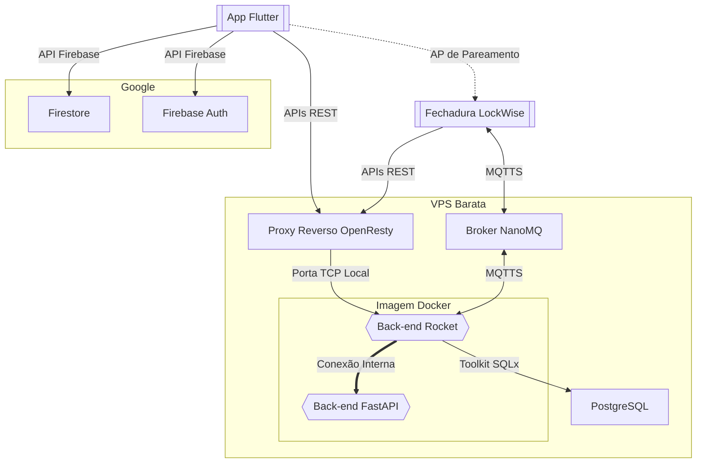

[← Anterior: Sistema Embarcado](Embedded.md)

# Desenvolvimento do Back-End

## Introdução

Inicialmente, planejávamos não escrever um *back-end*, mas usar o
[Firebase](https://firebase.google.com/) para toda a comunicação remota entre
o aplicativo e o dispositivo, usando as funcionalidades integradas da
plataforma para comunicação via MQTT. Infelizmente, com a deprecação do serviço
de reconhecimento de voz que originalmente planejamos usar, ficou claro que
teríamos que implementar um *back-end*, nem que mínimo, para calcular os
[*embeddings* ECAPA-TDNN](https://arxiv.org/abs/2104.01466) que usaríamos
para fazer a diarização da voz — como descrevemos abaixo — e, assim,
identificar sem ambiguidade quem é o locutor. O plano seguinte, então, era
fazer um único componente para o *back-end:* um serviço simples em Python,
usando [SpeechBrain](https://speechbrain.github.io/) e alguma framework web
leve, para controlar tanto o reconhecimento de voz quanto as funcionalidades do
aplicativo que exigissem mais segurança que o plano gratuito do Firebase é
capaz de providenciar. Eventualmente, essa ideia foi descartada pela
dificuldade que teríamos de dividir as tarefas, e pela dificuldade de escrever
um *back-end* robusto e com desempenho decente nessa linguagem — decidimos
dividir o *back-end* em dois serviços: um *back-end “principal”*, e um serviço
isolado em Python para a diarização:



Outros componentes constituem a arquitetura final do *back-end*. No diagrama
acima, temos todos os serviços usados no depoimento final: o aplicativo se
comunica ao Firebase e ao back-end; a fechadura se comunica com o broker e com
o back-end; o back-end se comunica internamente na imagem, e se comunica com o
banco de dados; um proxy reverso *[OpenResty](https://openresty.org/en/)* ou
*[Nginx](https://nginx.org/en/)* providencia TLS.


##  Serviço [Rocket](https://rocket.rs/) (Back-End Principal)

### Visão Geral

Este é o componente que coordena a comunicação entre todos os outros: ele
publica nos tópicos de controle MQTT dos dispositivos, monitora seus tópicos de
estado, se comunica com o banco de dados
[PostgreSQL](https://www.postgresql.org/), processa as requisições do
aplicativo, e recebe as amostras de áudio dos dispositivos e as transfere ao
serviço de *Speaker Recognition*. Todas as requisições que exigem segurança e
validação ocorrem aqui: este é o coração do *back-end*.

#### Escolha da Stack

O back-end principal foi desenvolvido utilizando
[Rust](https://www.rust-lang.org/) como linguagem de programação, combinado
com o framework web [Rocket](https://rocket.rs/). Essa escolha se deve
majoritariamente à preferência pessoal do desenvolvedor, que estava estudando
Rust nas aulas da disciplina *Linguagens de Programação*. A framework foi
escolhida devido à sua simplicidade, e pela sua forte integração com o
*runtime* [Tokio](https://tokio.rs/), que já tinha utilizado em projetos
pessoais. Além disso, a tipagem estática e *rígida* do Rust nos ajudaria a ter
confiança de que o código, uma vez compilado, funcionaria como esperado, e
seria extremamente portátil. O driver de SQL usado foi o *toolkit*
[`sqlx`](https://github.com/launchbadge/sqlx), devido à sua simplicidade.

#### Arquitetura da API

A arquitetura da API segue princípios RESTful, com endpoints claramente
definidos para cada domínio funcional. O sistema utiliza JSON como formato de
intercâmbio de dados, e valida *payloads* automaticamente por meio de `structs`
Rust derivadas pelo [Serde](https://serde.rs/). Cada endpoint é protegido por
*middleware* de autenticação baseado em JWT (JSON Web Tokens), impedindo que
usuários não autorizados acessem quaisquer recursos. A estrutura
do código é modular e organizada em módulos discretos.

#### Integração com Banco de Dados

A integração com [PostgreSQL](https://www.postgresql.org/) é realizada
através da biblioteca [SQLx](https://github.com/launchbadge/sqlx), um toolkit
SQL assíncrono para Rust que oferece *type safety* nativo e desempenho elevado.
Todas as operações de banco são executadas de forma assíncrona, e o sistema
utiliza *prepared statements* para prevenir *SQL injection*, e *migrations*
simples para um grosso versionamento do *schema*. A modelagem de dados segue
princípios de normalização, com tabelas para usuários, dispositivos, convites e
logs.

#### Gerência via MQTT

A gerência de comunicação MQTT é implementada usando a biblioteca
[Rumqttc](https://crates.io/crates/rumqttc), um cliente MQTT robusto escrito
em Rust puro. O sistema mantém conexões persistentes com o broker NanoMQ,
publicando comandos de controle para dispositivos e se inscrevendo em tópicos
de telemetria. Cada dispositivo possui tópicos dedicados para comunicação
bidirecional. O processamento de mensagens é assíncrono, para que o back-end
lide com múltiplos dispositivos simultaneamente sem degradação do desempenho.

#### Processamento de Áudio e Integração com FastAPI

O processamento de voz é realizado por integração com o serviço FastAPI
dedicado (descrito abaixo), utilizando comunicação interna via HTTP dentro do
mesmo container Docker. Quando uma requisição de autenticação por voz é
recebida, o Rocket extrai as amostras de áudio do *payload*, as transmite para
o serviço SpeechBrain, e aguarda o resultado da verificação. Essa arquitetura
desacoplada isola as responsabilidades, e separa o código *back-end* principal
que exige baixa latência do código Python para verificação de locutor, que é
mais lenta e estritamente não-paralelizada.

### Detalhes de Implementação

Por se tratar de um programa muito grande, trataremos apenas dos seus
principais componentes, e mencionaremos apenas os *endpoints* mais importantes
a fim de ilustrar a estrutura do programa.

#### Função Principal (main.rs)

##### Função `main`

A função `main` é o ponto de entrada da aplicação Rocket, estruturada em blocos
lógicos para inicialização sequencial.

```rust
#[tokio::main]
async fn main() -> Result<()> {
    dotenv::dotenv().ok();

    // Load env vars
    let db_url = env::var("DATABASE_URL").expect("DATABASE_URL must be set");
    let mqtt_host = env::var("MQTT_HOST").expect("MQTT_HOST must be set");
    let mqtt_port: u16 = env::var("MQTT_PORT")
        .map(|s| s.parse().unwrap())
        .unwrap_or(1883);
    let mqtt_tls: bool = env::var("MQTT_TLS")
        .map(|s| s.parse().unwrap())
        .unwrap_or(false);
    let mqtt_username = env::var("MQTT_USERNAME").ok();
    let mqtt_password = env::var("MQTT_PASSWORD").ok();
    let port: u16 = env::var("PORT")
        .unwrap_or("8000".to_string())
        .parse()
        .unwrap();
    let speechbrain_url =
        SpeechbrainUrl(env::var("SPEECHBRAIN_URL").unwrap_or("http://localhost:5008".to_string()));
    let homepage_url =
        HomepageUrl(env::var("HOMEPAGE_URL").unwrap_or("https://example.com".to_string()));
    RECENT_COMMANDS.set(Mutex::new(HashMap::new())).unwrap();
    PENDING_PINGS.set(Mutex::new(HashMap::new())).unwrap();
    PENDING_CONFIG_UPDATES
        .set(Mutex::new(HashMap::new()))
        .unwrap();

    // ... (continua)
}
```

Este bloco inicial carrega variáveis de ambiente usando `dotenv`, define
configurações para banco de dados, MQTT, portas e URLs de serviço. Inicializa
armazenamentos globais thread-safe para comandos recentes, *pings* pendentes, e
atualizações de configuração usando `OnceLock` e `Mutex`.

```rust
    // Setup DB
    let url = Url::parse(&db_url)?;
    let options = PgConnectOptions::from_url(&url)?.ssl_mode(PgSslMode::Require);
    let db_pool = PgPoolOptions::new()
        .max_connections(5)
        .connect_with(options)
        .await?;

    // ... (continua)
```

Configura conexão com PostgreSQL usando SQLx, analisando URL e aplicando TLS
obrigatório. Cria pool de conexões com máximo de 5 conexões simultâneas para
eficiência.

```rust
    // Create devices table if not exists
    sqlx::query("CREATE TABLE IF NOT EXISTS devices ( uuid uuid PRIMARY KEY, user_id VARCHAR(255), last_heard timestamptz NOT NULL, uptime_ms bigint NOT NULL, hashed_passphrase VARCHAR(255), locked_down_at timestamptz)")
        .execute(&db_pool)
        .await?;

    // Create users table if not exists
    sqlx::query("CREATE TABLE IF NOT EXISTS users ( firebase_uid VARCHAR(255) PRIMARY KEY, hashed_password VARCHAR(255) NOT NULL, email VARCHAR(255) NOT NULL, phone_number VARCHAR(255), name VARCHAR(255) NOT NULL, current_token VARCHAR(255), voice_embeddings BYTEA, created_at timestamptz NOT NULL DEFAULT NOW(), last_login timestamptz)")
        .execute(&db_pool)
        .await?;

    // ... (migrações adicionais para logs, invites, colunas)
```

Cria tabelas essenciais se não existirem: `devices` para dispositivos IoT,
`users` para contas de usuário, `logs` para histórico de operações, `invites`
para compartilhamento temporário. Inclui migrações para adicionar colunas
conforme evolução do schema.

```rust
    // Setup MQTT
    let mut mqtt_options = MqttOptions::new("backend", mqtt_host, mqtt_port);
    if let Some(user) = mqtt_username {
        mqtt_options.set_credentials(user, mqtt_password.unwrap_or_default());
    }
    if mqtt_tls {
        mqtt_options.set_transport(Transport::tls_with_default_config());
    }

    let (mqtt_client, mut eventloop) = AsyncClient::new(mqtt_options, 10);

    // Subscribe to status topics
    mqtt_client
        .subscribe("lockwise/+/status", QoS::AtMostOnce)
        .await?;

    // ... (continua)
```

Configura cliente MQTT com *Rumqttc*, aplicando credenciais e TLS se
necessário. Cria cliente e *event loop* com capacidade de 10 mensagens.
Inscreve-se em tópicos de *status* de todos os dispositivos usando wildcard.

```rust
    // Spawn MQTT event handler
    let db_pool_clone = db_pool.clone();
    tokio::spawn(async move {
        mqtt::handle_mqtt_events(&db_pool_clone, &mut eventloop).await;
    });

    // ... (continua)
```

Inicia tarefa assíncrona dedicada para processar eventos MQTT recebidos,
atualizando banco de dados com *status* de dispositivos e logs.

```rust
    // Spawn log cleanup task
    let db_pool_cleanup = db_pool.clone();
    tokio::spawn(async move {
        loop {
            tokio::time::sleep(std::time::Duration::from_secs(3600)).await; // 1 hour
            let one_month_ago = Utc::now() - chrono::Duration::days(30);
            let _ = sqlx::query("DELETE FROM logs WHERE timestamp < $1")
                .bind(one_month_ago)
                .execute(&db_pool_cleanup)
                .await;
        }
    });

    // ... (continua)
```

Inicia tarefa de limpeza periódica que remove logs com mais de 30 dias para
controle de tamanho do banco.

```rust
    // Spawn Rocket HTTP server
    tokio::spawn(async move {
        rocket::build()
            .configure(
                rocket::Config::figment()
                    .merge(("port", port))
                    .merge(("address", "0.0.0.0"))
                    .merge(("workers", num_cpus::get())),
            )
            .manage(db_pool)
            .manage(mqtt_client)
            .manage(speechbrain_url)
            .manage(homepage_url)
            .mount(
                "/",
                routes![
                    index,
                    health,
                    device::control_device,
                    device::control_temp_device,
                    device::get_accessible_devices,
                    // ... (continua) ...
                    user::update_phone,
                    user::verify_password,
                    user::voice_status
                ],
            )
            .launch()
            .await
            .unwrap();
    });

    // For now, just keep running
    tokio::signal::ctrl_c().await?;
    Ok(())
}
```

Inicia servidor HTTP Rocket configurado para aceitar conexões em todas as
interfaces, utilizando número de workers igual ao número de CPUs. Monta todas
as rotas da API e injeta dependências (pool de banco, cliente MQTT, URLs).
Aguarda sinal de interrupção via `SIGINT` (`Ctrl+C`) para encerramento.

##### Estrutura `Token`

```rust
#[derive(Clone)]
pub struct Token(pub String);
```

Invólucro para tokens JWT extraídos de cabeçalhos HTTP. Implementa
`FromRequest` para validação automática em endpoints.

```rust
#[rocket::async_trait]
impl<'r> FromRequest<'r> for Token {
    type Error = &'static str;

    /// Extrai o token JWT Bearer do cabeçalho Authorization da requisição.
    async fn from_request(req: &'r Request<'_>) -> rocket::request::Outcome<Self, Self::Error> {
        let auth_header = req.headers().get_one("Authorization");
        match auth_header {
            Some(auth) if auth.starts_with("Bearer ") => {
                let token_str = &auth[7..];
                Outcome::Success(Token(token_str.to_string()))
            }
            _ => Outcome::Error((
                Status::Unauthorized,
                "Missing or invalid Authorization header",
            )),
        }
    }
}
```

Valida presença do cabeçalho `Authorization` com formato `Bearer <token>`,
retornando erro 401 se inválido.

#### Estrutura `DeviceToken` (device.rs)

```rust
#[derive(Clone)]
pub struct DeviceToken(pub String);
```

Similar ao `Token`, mas usado para autenticação das fechaduras quando enviam
amostras de voz. Diferente dos tokens JWT acima, estes representam senhas,
processadas com [Argon2](https://argon2.com/).

```rust
#[rocket::async_trait]
impl<'r> FromRequest<'r> for DeviceToken {
    type Error = &'static str;

    /// Extrai o token Bearer do cabeçalho Authorization da requisição.
    async fn from_request(req: &'r Request<'_>) -> Outcome<Self, Self::Error> {
        let auth_header = req.headers().get_one("Authorization");
        match auth_header {
            Some(auth) if auth.starts_with("Bearer ") => {
                let token_str = &auth[7..];
                Outcome::Success(DeviceToken(token_str.to_string()))
            }
            _ => Outcome::Error((
                Status::Unauthorized,
                "Missing or invalid Authorization header",
            )),
        }
    }
}
```

Valida presença do cabeçalho `Authorization` com formato `Bearer <token>`, para
ser usado em endpoints de verificação de voz onde o dispositivo se autentica
com sua senha *hasheada*.

#### Endpoint `get_devices`

```rust
#[get("/devices")]
pub async fn get_devices(token: Token, db_pool: &State<PgPool>) -> Result<String, Status> {
    // Validate token: get firebase_uid from current_token
    let user_row: Option<(String,)> =
        sqlx::query_as("SELECT firebase_uid FROM users WHERE current_token = $1")
            .bind(&token.0)
            .fetch_optional(&**db_pool)
            .await
            .map_err(|_| Status::InternalServerError)?;
    let firebase_uid = match user_row {
        Some((uid,)) => uid,
        None => return Err(Status::Unauthorized),
    };

    let rows = sqlx::query(
        "SELECT uuid, user_id, last_heard, uptime_ms, wifi_ssid, backend_url, mqtt_broker_url, mqtt_heartbeat_enable, mqtt_heartbeat_interval_sec, audio_record_timeout_sec, lock_timeout_ms, pairing_timeout_sec, lock_state, locked_down_at, voice_detection_enable, voice_invite_enable, voice_threshold, vad_rms_threshold FROM devices WHERE user_id = $1",
    )
    .bind(&firebase_uid)
    .fetch_all(&**db_pool)
    .await
    .map_err(|_| Status::InternalServerError)?;

    let rows_vec: Vec<_> = rows;
    let devices: Vec<serde_json::Value> = rows_vec
        .into_iter()
        .map(|row| {
            let db_uuid: Uuid = row.get(0);
            let last_heard: chrono::DateTime<chrono::Utc> = row.get(2);
            let uptime_ms: Option<i64> = row.get(3);
            let wifi_ssid: Option<String> = row.get(4);
            let backend_url: Option<String> = row.get(5);
            let mqtt_broker_url: Option<String> = row.get(6);
            let mqtt_heartbeat_enable: Option<bool> = row.get(7);
            let mqtt_heartbeat_interval_sec: Option<i32> = row.get(8);
            let audio_record_timeout_sec: Option<i32> = row.get(9);
            let lock_timeout_ms: Option<i32> = row.get(10);
            let pairing_timeout_sec: Option<i32> = row.get(11);
            let lock_state: Option<String> = row.get(12);
            let locked_down_at: Option<chrono::DateTime<chrono::Utc>> = row.get(13);
            let voice_detection_enable: Option<bool> = row.get(14);
            let voice_invite_enable: Option<bool> = row.get(15);
            let voice_threshold: Option<f64> = row.get(16);
            let vad_rms_threshold: Option<i32> = row.get(17);
            serde_json::json!({
                "uuid": db_uuid.to_string(),
                "user_id": firebase_uid,
                "last_heard": last_heard.timestamp_millis(),
                "uptime_ms": uptime_ms,
                "wifi_ssid": wifi_ssid,
                "backend_url": backend_url,
                "mqtt_broker_url": mqtt_broker_url,
                "mqtt_heartbeat_enable": mqtt_heartbeat_enable,
                "mqtt_heartbeat_interval_sec": mqtt_heartbeat_interval_sec,
                "audio_record_timeout_sec": audio_record_timeout_sec,
                "lock_timeout_ms": lock_timeout_ms,
                "pairing_timeout_sec": pairing_timeout_sec,
                "lock_state": lock_state,
                "locked_down_at": locked_down_at.map(|dt| dt.timestamp_millis()),
                "voice_detection_enable": voice_detection_enable,
                "voice_invite_enable": voice_invite_enable,
                "voice_threshold": voice_threshold,
                "vad_rms_threshold": vad_rms_threshold
            })
        })
        .collect();

    Ok(serde_json::to_string(&devices).unwrap())
}
```

Retorna lista JSON de dispositivos pertencentes ao usuário autenticado,
incluindo configurações como Wi-Fi, *timeouts* e estado de bloqueio: valida
token JWT, consulta tabela `devices` filtrando por `user_id`, e mapeia
resultados para objetos JSON com *timestamps* em milissegundos.

#### Endpoint `get_logs`

```rust
#[get("/logs/<uuid>")]
pub async fn get_logs(token: Token, uuid: &str, db_pool: &State<PgPool>) -> Result<String, Status> {
    let uuid_parsed = Uuid::parse_str(uuid).map_err(|_| Status::BadRequest)?;

    // Validate token: get firebase_uid from current_token
    let user_row: Option<(String,)> =
        sqlx::query_as("SELECT firebase_uid FROM users WHERE current_token = $1")
            .bind(&token.0)
            .fetch_optional(&**db_pool)
            .await
            .map_err(|_| Status::InternalServerError)?;
    let firebase_uid = match user_row {
        Some((uid,)) => uid,
        None => {
            return Err(Status::Unauthorized);
        }
    };

    // Check that the device belongs to this user (logs only for owners)
    let row: Option<(Option<String>,)> =
        sqlx::query_as("SELECT user_id FROM devices WHERE uuid = $1")
            .bind(uuid_parsed)
            .fetch_optional(&**db_pool)
            .await
            .map_err(|_| Status::InternalServerError)?;
    if let Some((Some(db_user_id),)) = row {
        if firebase_uid != db_user_id {
            return Err(Status::Unauthorized);
        }
    } else {
        return Err(Status::Unauthorized); // Device not found or not owned
    }

    // Get logs, limit to 1000
    let rows = sqlx::query("SELECT l.id, l.device_id, l.timestamp, l.event_type, l.reason, l.user_id, u.name as user_name FROM logs l LEFT JOIN users u ON l.user_id = u.firebase_uid WHERE l.device_id = $1 ORDER BY l.timestamp DESC LIMIT 1000")
        .bind(uuid_parsed.to_string())
        .fetch_all(&**db_pool)
        .await
        .map_err(|_| {
            Status::InternalServerError
        })?;
    let logs: Vec<LogEntry> = rows
        .into_iter()
        .map(|row| LogEntry {
            id: row.get(0),
            device_id: row.get(1),
            timestamp: row.get(2),
            event_type: row.get(3),
            reason: row.get(4),
            user_id: row.get(5),
            user_name: row.get(6),
        })
        .collect();

    Ok(serde_json::to_string(&logs).unwrap())
}
```

Retorna histórico de operações de um dispositivo específico, limitado a 1000
entradas mais recentes: valida propriedade do dispositivo pelo usuário, junta
tabelas `logs` e `users` para incluir nomes de usuários, e ordena por
*timestamp* descendente.

#### Endpoint `control_device`

```rust
#[post("/control/<uuid>", data = "<request>")]
pub async fn control_device(
    token: Token,
    uuid: &str,
    request: rocket::serde::json::Json<ControlRequest>,
    db_pool: &State<PgPool>,
    mqtt_client: &State<AsyncClient>,
) -> Result<(), Status> {
    let uuid = Uuid::parse_str(uuid).map_err(|_| Status::BadRequest)?;

    // Validate token: get firebase_uid from current_token
    let user_row: Option<(String,)> =
        sqlx::query_as("SELECT firebase_uid FROM users WHERE current_token = $1")
            .bind(&token.0)
            .fetch_optional(&**db_pool)
            .await
            .map_err(|_| Status::InternalServerError)?;
    let firebase_uid = match user_row {
        Some((uid,)) => uid,
        None => return Err(Status::Unauthorized),
    };

    // Check Firebase UID matches request user_id
    if firebase_uid != request.user_id {
        return Err(Status::Unauthorized);
    }

    // Check if user owns the device OR has an accepted, non-expired invite
    let device_row: Option<(Option<String>,)> =
        sqlx::query_as("SELECT user_id FROM devices WHERE uuid = $1")
            .bind(uuid)
            .fetch_optional(&**db_pool)
            .await
            .map_err(|_| Status::InternalServerError)?;

    let has_access = if let Some((Some(owner_id),)) = device_row {
        // User owns the device
        if request.user_id == owner_id {
            true
        } else {
            // Check for accepted, non-expired invite
            let now = Utc::now().timestamp_millis();
            let invite_row: Option<(i32,)> = sqlx::query_as(
                "SELECT id FROM invites WHERE device_id = $1 AND receiver_id = $2 AND status = 1 AND expiry_timestamp > $3"
            )
            .bind(uuid)
            .bind(&request.user_id)
            .bind(now)
            .fetch_optional(&**db_pool)
            .await
            .map_err(|_| Status::InternalServerError)?;
            invite_row.is_some()
        }
    } else {
        false // Device not found
    };

    if !has_access {
        return Err(Status::Unauthorized);
    }

    // Store recent command
    let now = chrono::Utc::now().timestamp();
    {
        let commands_mutex = super::RECENT_COMMANDS.get().unwrap();
        let mut commands = commands_mutex.lock().unwrap();
        commands.insert(uuid.to_string(), (firebase_uid.clone(), now));
    }

    publish_control_message(mqtt_client, uuid, request.command.clone())
        .await
        .map_err(|_| Status::InternalServerError)?;
    Ok(())
}
```

Processa comandos para abrir ou fechar uma fechadura: valida token e
propriedade/invite ativo, armazena comando recente para deduplicação, publica
mensagem MQTT para o dispositivo, e registra log da operação no banco.

#### Endpoint `verify_voice`

```rust
#[post("/verify_voice/<device_id>", data = "<audio_data>")]
pub async fn verify_voice(
    device_id: &str,
    device_token: DeviceToken,
    audio_data: rocket::data::Data<'_>,
    db_pool: &State<PgPool>,
    speechbrain_url: &State<SpeechbrainUrl>,
) -> Result<rocket::serde::json::Json<serde_json::Value>, Status> {
    let device_uuid = Uuid::parse_str(device_id).map_err(|_| Status::BadRequest)?;

    // Get device info including voice_invite_enable, voice_threshold, and hashed_passphrase
    let device_row: Option<DeviceVoiceRow> = sqlx::query_as(
        "SELECT user_id, voice_invite_enable, voice_threshold, hashed_passphrase FROM devices WHERE uuid = $1",
    )
    .bind(device_uuid)
    .fetch_optional(&**db_pool)
    .await
    .map_err(|_| Status::InternalServerError)?;

    let (user_id, voice_invite_enable, voice_threshold, _hashed_passphrase) = match device_row {
        Some(row)
            if row.user_id.is_some()
                && row.voice_invite_enable.is_some()
                && row.voice_threshold.is_some() =>
        {
            let uid = row.user_id.unwrap();
            let vie = row.voice_invite_enable.unwrap();
            let vt = row.voice_threshold.unwrap();
            let hp = row.hashed_passphrase;
            println!(
                "DEBUG: Device found, user_id: {}, voice_invite_enable: {}, voice_threshold: {}",
                uid, vie, vt
            );
            // Verify the bearer token against the hashed passphrase
            if let Some(ref hash) = hp {
                let parsed_hash =
                    PasswordHash::new(hash).map_err(|_| Status::InternalServerError)?;
                let argon2 = Argon2::default();
                if argon2
                    .verify_password(device_token.0.as_bytes(), &parsed_hash)
                    .is_err()
                {
                    return Err(Status::Unauthorized);
                }
            } else {
                // No passphrase set, deny access
                return Err(Status::Unauthorized);
            }
            (uid, vie, vt, hp)
        }
        _ => {
            return Err(Status::BadRequest);
        }
    };

    // Collect embeddings
    let mut user_embeddings = Vec::new();
    let mut user_ids = Vec::new();

    // Always include owner
    let owner_row: Option<(Option<Vec<u8>>,)> =
        sqlx::query_as("SELECT voice_embeddings FROM users WHERE firebase_uid = $1")
            .bind(&user_id)
            .fetch_optional(&**db_pool)
            .await
            .map_err(|_| Status::InternalServerError)?;

    if let Some((Some(emb),)) = owner_row {
        println!(
            "DEBUG: Found voice embeddings for owner {} ({} bytes)",
            user_id,
            emb.len()
        );
        user_embeddings.push(base64::engine::general_purpose::STANDARD.encode(&emb));
        user_ids.push(user_id.clone());
    } else {
        return Err(Status::BadRequest); // Owner must have voice registered
    }

    // If voice_invite_enable, include invited users
    if voice_invite_enable {
        let now = Utc::now().timestamp_millis();
        let invite_rows: Vec<(String, Vec<u8>)> = sqlx::query_as(
            "SELECT u.firebase_uid, u.voice_embeddings FROM users u JOIN invites i ON u.firebase_uid = i.receiver_id WHERE i.device_id = $1 AND i.status = 1 AND i.expiry_timestamp > $2 AND u.voice_embeddings IS NOT NULL"
        )
        .bind(device_uuid)
        .bind(now)
        .fetch_all(&**db_pool)
        .await
        .map_err(|_| {
            Status::InternalServerError
        })?;

        for (invite_user_id, emb) in invite_rows {
            println!(
                "DEBUG: Found voice embeddings for invited user {} ({} bytes)",
                invite_user_id,
                emb.len()
            );
            user_embeddings.push(base64::engine::general_purpose::STANDARD.encode(&emb));
            user_ids.push(invite_user_id);
        }
    }

    if user_embeddings.is_empty() {
        return Err(Status::BadRequest);
    }

    println!(
        "DEBUG: Collected {} embeddings from users: {:?}",
        user_embeddings.len(),
        user_ids
    );

    // Read audio data
    let mut data = Vec::new();
    audio_data
        .open(rocket::data::ByteUnit::max_value())
        .read_to_end(&mut data)
        .await
        .map_err(|_| Status::BadRequest)?;

    if data.is_empty() {
        return Err(Status::BadRequest);
    }

    // Call speechbrain service
    println!(
        "DEBUG: Calling speechbrain verify service at {}/verify",
        speechbrain_url.0.as_str()
    );
    let client = Client::new();
    let base64_data = base64::engine::general_purpose::STANDARD.encode(&data);

    let response = client
        .post(format!("{}/verify", speechbrain_url.0.as_str()))
        .header("Content-Type", "application/json")
        .json(&serde_json::json!({
            "pcm_base64": base64_data,
            "candidates": user_embeddings
        }))
        .send()
        .await
        .map_err(|_| Status::InternalServerError)?;

    println!(
        "DEBUG: Speechbrain verify response status: {}",
        response.status()
    );

    if !response.status().is_success() {
        return Err(Status::InternalServerError);
    }

    let verify_response: serde_json::Value = response.json().await.map_err(|e| {
        println!(
            "DEBUG: Failed to parse speechbrain verify response: {:?}",
            e
        );
        Status::InternalServerError
    })?;

    let best_index = verify_response["best_index"]
        .as_u64()
        .ok_or(Status::InternalServerError)? as usize;

    let score = verify_response["score"]
        .as_f64()
        .ok_or(Status::InternalServerError)?;

    println!(
        "DEBUG: Verification best_index: {}, score: {}",
        best_index, score
    );

    if score > voice_threshold && best_index < user_ids.len() {
        println!(
            "DEBUG: Score {} > {}, allowing unlock for user at index {}",
            score, voice_threshold, best_index
        );

        let matched_user_id = &user_ids[best_index];

        // Store recent voice verification
        let now = chrono::Utc::now().timestamp();
        {
            let commands_mutex = super::RECENT_COMMANDS.get().unwrap();
            let mut commands = commands_mutex.lock().unwrap();
            commands.insert(device_id.to_string(), (matched_user_id.clone(), now));
        }

        println!(
            "DEBUG: Stored recent voice verification for user {}",
            matched_user_id
        );
        Ok(rocket::serde::json::Json(
            serde_json::json!({"index": best_index}),
        ))
    } else {
        println!(
            "DEBUG: Score {} <= {} or invalid index {}, denying unlock",
            score, voice_threshold, best_index
        );
        Err(Status::Forbidden)
    }
}
```

Endpoint crítico para autenticação por voz da amostra enviada pela fechadura:
autentica dispositivo usando `DeviceToken` (senha *hasheada* do dispositivo),
coleta embeddings de voz do proprietário e usuários convidados (se habilitado),
codifica áudio PCM em *base64* e envia para serviço SpeechBrain, compara score
de similaridade com threshold configurado, registra verificação bem-sucedida
como comando recente, retorna índice do usuário identificado ou erro 403 se
negado.

## Serviço [FastAPI](https://fastapi.tiangolo.com/) (*SpeechBrain*)

### Visão Geral

#### Escolha da Stack

A solução implementada utiliza Python como linguagem de programação principal,
combinada com as bibliotecas [PyTorch](https://pytorch.org/) e
[SpeechBrain](https://speechbrain.github.io/). Esta escolha se justifica por
diversos fatores técnicos e práticos. O Python oferece um ecossistema maduro e
bem estabelecido para aplicações de aprendizado de máquina, com ampla
documentação e suporte da comunidade. O PyTorch, por sua vez, representa o
estado da arte em frameworks de aprendizado profundo, e proporciona
flexibilidade na manipulação de tensores e operações em GPU quando necessário.
A biblioteca SpeechBrain foi selecionada especificamente por fornecer modelos
pré-treinados de alta qualidade para tarefas de processamento de áudio e fala,
eliminando a necessidade de treinamento do zero e garantindo resultados
consistentes e academicamente validados.

#### Modelo Utilizado

O modelo escolhido foi o
[`spkrec-ecapa-voxceleb`](https://huggingface.co/speechbrain/spkrec-ecapa-voxceleb)
disponibilizado pelo SpeechBrain. Trata-se de uma implementação da arquitetura
[ECAPA-TDNN *(Emphasized Channel Attention, Propagation and Aggregation in
Time Delay Neural Network)*](https://arxiv.org/abs/2104.01466), treinada na
base de dados [VoxCeleb](https://www.robots.ox.ac.uk/~vgg/data/voxceleb/),
que contém milhares de horas de gravações de fala de diversos locutores em
condições variadas. A seleção deste modelo se fundamenta em seu desempenho
comprovado em tarefas de verificação e identificação de locutor, com taxa de
erro significativamente reduzida em comparação com arquiteturas anteriores. A
arquitetura ECAPA-TDNN incorpora mecanismos de atenção que permitem ao modelo
focar nas características mais discriminativas da voz, resultando em
*embeddings* mais robustos e distintivos para cada locutor.

#### Funcionamento do Modelo

O modelo opera transformando amostras de áudio bruto em representações
vetoriais de dimensão fixa. O processamento inicia com a conversão do áudio PCM
de 16 bits em formato de waveform normalizado, seguido de reamostragem para
16kHz quando necessário, frequência na qual o modelo foi treinado. A
arquitetura ECAPA-TDNN processa então este sinal através de múltiplas camadas
convolucionais temporais (TDNN), que extraem características acústicas em
diferentes escalas temporais. Os blocos de atenção de canal enfatizam as
características mais relevantes para identificação do locutor, enquanto camadas
de pooling estatístico agregam informações ao longo de toda a duração do áudio.
O resultado final é um vetor de *embedding* de 192 dimensões que encapsula as
características biométricas vocais únicas do locutor. Este vetor é normalizado
para ter norma unitária, garantindo que comparações posteriores se baseiem
exclusivamente na direção do vetor no espaço de características, não em sua
magnitude.

#### Armazenamento e Comparação de *Embeddings*

Os vetores de 192 dimensões gerados pelo modelo são serializados em formato
*base64* para transmissão eficiente. Esta representação compacta permite que os
*embeddings* sejam facilmente transmitidos por APIs REST. Para a tarefa de
verificação de locutor, o sistema calcula a similaridade de cossenos entre o
*embedding* da amostra de teste e os *embeddings* armazenados dos locutores
conhecidos. A similaridade de cossenos mede o ângulo entre dois vetores no
espaço de 192 dimensões, produzindo um valor entre −1 e 1, onde valores
próximos a 1 indicam alta similaridade entre as vozes. Devido à normalização
dos *embeddings*, esta métrica se torna equivalente ao produto escalar entre os
vetores, o que constitui uma implementação computacionalmente eficiente. O
locutor identificado é aquele cujo *embedding* armazenado apresenta a maior
similaridade com a amostra de teste, com o valor de score fornecendo uma medida
de confiança na identificação.

### Detalhes de Implementação

O serviço SpeechBrain é implementado como uma aplicação FastAPI que expõe
endpoints REST para processamento de áudio e reconhecimento de voz. A
implementação é estruturada em seções bem definidas, cada uma com
responsabilidades específicas.

#### Configuração do Modelo

```py
MODEL_SOURCE = "speechbrain/spkrec-ecapa-voxceleb"
MODEL_DIR = "models/spkrec"

EXPECTED_SR = 44100
MODEL_SR = 16000
MIN_SECONDS = 2.0
```

- `MODEL_SOURCE`: Especifica o identificador do modelo pré-treinado no [Hugging
Face](https://huggingface.co/).
- `MODEL_DIR`: Diretório local onde o modelo será armazenado após o download
inicial.
- `EXPECTED_SR`: Taxa de amostragem esperada dos dados de áudio de entrada
(44.1kHz), usada no cadastro de voz do *app* e na gravação do dispositivo.
- `MODEL_SR`: Taxa de amostragem para a qual o modelo foi treinado (16kHz),
para reamostragem, quando necessário.
- `MIN_SECONDS`: Duração mínima de áudio necessária para extração confiável de
*embedding* (2 segundos).

#### Carregamento do Modelo

```py
try:
    print("DEBUG: Loading SpeechBrain model")
    from speechbrain.utils.fetching import LocalStrategy

    spkrec = SpeakerRecognition.from_hparams(
        source=MODEL_SOURCE,
        savedir=MODEL_DIR,
        run_opts={"device": "cpu"},
        local_strategy=LocalStrategy.NO_LINK,
    )
    print("DEBUG: SpeechBrain model loaded successfully")
except Exception as e:
    print(f"DEBUG: Failed to load SpeechBrain model: {e}")
    exit(1)

resampler = torchaudio.transforms.Resample(orig_freq=EXPECTED_SR, new_freq=MODEL_SR)
```

O carregamento do modelo é realizado uma única vez na inicialização do serviço:

- `LocalStrategy.NO_LINK`: Estratégia de download que evita usar links
simbólicos (atalhos de arquivo) para salvar os modelos, o que facilita
incluí-los na imagem [Docker](https://www.docker.com/).
- `run_opts={"device": "cpu"}`: Força execução em CPU, já que nosso VPS não
conta com GPU, e que o SpeechBrain em si não se beneficia tanto de GPU
discreta.
- `SpeakerRecognition.from_hparams()`: Carrega o modelo pré-treinado com todos
os hiperparâmetros predeterminados.
- `torchaudio.transforms.Resample`: Cria um objeto de reamostragem para
converter áudio de 44.1kHz para 16kHz quando necessário.

#### Funções Utilitárias

##### Conversão de Áudio PCM

```py
def pcm16_to_waveform(pcm_bytes: bytes) -> torch.Tensor:
    samples = np.frombuffer(pcm_bytes, dtype=np.int16)
    if samples.size == 0:
        raise ValueError("Empty audio buffer")

    waveform = samples.astype(np.float32) / 32768.0
    waveform = torch.from_numpy(waveform).unsqueeze(0)
    return waveform
```

Esta função converte dados de áudio bruto em formato adequado para processamento pelo modelo:

- `np.frombuffer(pcm_bytes, dtype=np.int16)`: Interpreta os bytes como amostras
de 16 bits *signed*, formato padrão PCM.
- `astype(np.float32) / 32768.0`: Normaliza os valores para o intervalo `[-1,
1]`, esperado pelo PyTorch e modelos de deep learning.
- `torch.from_numpy()`: Converte para tensor PyTorch.
- `unsqueeze(0)`: Adiciona dimensão de batch, necessária para processamento em
lote pelo modelo (mesmo para áudio single-channel).

##### Extração de Embedding

```py
def extract_embedding(pcm_bytes: bytes) -> np.ndarray:
    waveform = pcm16_to_waveform(pcm_bytes)
    if EXPECTED_SR != MODEL_SR:
        waveform = resampler(waveform)

    min_samples = int(MIN_SECONDS * MODEL_SR)
    if waveform.shape[1] < min_samples:
        raise ValueError("Audio too short")

    with torch.no_grad():
        emb = spkrec.encode_batch(waveform)

    emb = emb.squeeze(0).cpu().numpy()
    emb /= np.linalg.norm(emb)
    return emb.astype(np.float32)
```

Função central que transforma áudio em representação vetorial:

- `resampler(waveform)`: Reamostra para 16kHz quando necessário.
- `min_samples`: Calcula número mínimo de amostras baseado em duração e taxa de
amostragem, para que haja dados suficientes.
- `torch.no_grad()`: Desabilita cálculo de gradientes durante inferência,
que não são necessários.
- `spkrec.encode_batch()`: Executa inferência no modelo, extraindo
características acústicas em 192 dimensões.
- `squeeze(0)`: Remove dimensão de batch desnecessária no resultado.
- `cpu().numpy()`: Move tensor da GPU (se estiver) para a CPU, e converte para
um *array* do NumPy.
- `emb /= np.linalg.norm(emb)`: Normaliza o vetor para norma unitária.

##### Serialização de Embeddings

```py
def serialize_embedding(emb: np.ndarray) -> str:
    return base64.b64encode(emb.tobytes()).decode("ascii")
```

- `emb.tobytes()`: Converte array NumPy em bytes brutos, mantendo a precisão de
32 bits.
- `base64.b64encode()`: Codifica em *base64* para transmissão segura pela API
REST.
- `.decode("ascii")`: Converte bytes *base64* para string ASCII, compatível com
APIs REST.

##### Desserialização de Embeddings

```py
def deserialize_embedding(data: str) -> np.ndarray:
    try:
        raw = base64.b64decode(data)
        print(f"DEBUG: Decoded {len(raw)} bytes from base64")
        emb = np.frombuffer(raw, dtype=np.float32).copy()  # Make a writable copy
        print(f"DEBUG: Created array with shape {emb.shape}")
        norm = np.linalg.norm(emb)
        print(f"DEBUG: Norm is {norm}")
        if norm > 0:
            emb /= norm
        else:
            print("DEBUG: Warning - norm is zero or negative")
        return emb
    except Exception as e:
        print(f"DEBUG: Error in deserialize_embedding: {e}")
        raise
```

Processo inverso da serialização:

- `base64.b64decode()`: Decodifica string *base64* de volta para bytes.
- `np.frombuffer(raw, dtype=np.float32)`: Reconstrói array NumPy com precisão
correta.
- `.copy()`: Cria cópia writable, pra evitar múltiplas referências ao mesmo
objeto.
- Verificação de norma e renormalização: tenta garantir consistência mesmo se
alguns dados foram corrompidos durante transmissão.

##### Cálculo de Similaridade

```py
def cosine_similarity(a: np.ndarray, b: np.ndarray) -> float:
    return float(np.dot(a, b))
```

- `np.dot(a, b)`: Calcula produto escalar entre vetores normalizados, equivalente à similaridade de cossenos devido à norma unitária.
- `float()`: Converte resultado NumPy para tipo Python nativo para serialização JSON.

#### Modelos de API

```py
class EmbedRequest(BaseModel):
    pcm_base64: str

class EmbedResponse(BaseModel):
    embedding: str

class VerifyRequest(BaseModel):
    pcm_base64: str
    candidates: list[str]

class VerifyResponse(BaseModel):
    best_index: int
    score: float
```

Classes [Pydantic](https://docs.pydantic.dev/latest/) definem contratos de API:

- `EmbedRequest`: Estrutura para requisições de extração de embedding, contendo
áudio codificado em *base64*.
- `EmbedResponse`: Resposta com embedding serializado para armazenamento.
- `VerifyRequest`: Dados para verificação de voz, incluindo áudio de teste e
lista de embeddings candidatos.
- `VerifyResponse`: Resultado da verificação com índice do melhor match e score
de confiança.

#### Aplicação FastAPI

```py
app = FastAPI()
```

Instancia aplicação [FastAPI](https://fastapi.tiangolo.com/), framework web
assíncrona otimizada para APIs REST com validação automática via
[Pydantic](https://docs.pydantic.dev/latest/).

##### Endpoint de Extração de Embedding

```py
@app.post("/embed", response_model=EmbedResponse)
def embed(req: EmbedRequest):
    try:
        pcm = base64.b64decode(req.pcm_bytes)
        emb = extract_embedding(pcm)
        return EmbedResponse(embedding=serialize_embedding(emb))
    except Exception as e:
        raise HTTPException(status_code=400, detail=str(e))
```

- `@app.post("/embed")`: Define rota POST para extração de embedding.
- `response_model=EmbedResponse`: Validação automática da resposta.
- Decodifica áudio, extrai embedding, serializa e retorna, convertendo exceções
em respostas HTTP 400 com detalhes.

##### Endpoint de Verificação de Voz

```py
@app.post("/verify", response_model=VerifyResponse)
def verify(req: VerifyRequest):
    try:
        print(f"DEBUG: Verify request with {len(req.candidates)} candidates")
        pcm = base64.b64decode(req.pcm_base64)
        print(f"DEBUG: Decoded {len(pcm)} bytes of audio data")

        if os.getenv("DEBUG_PLAY_AUDIO"):
            print("DEBUG: Playing audio sample")
            with tempfile.NamedTemporaryFile(suffix=".pcm", delete=False) as f:
                f.write(pcm)
                temp_file = f.name
            try:
                subprocess.run(
                    [
                        "mpv",
                        "--no-config",
                        "--demuxer=rawaudio",
                        "--demuxer-rawaudio-format=s16le",
                        "--demuxer-rawaudio-channels=1",
                        "--demuxer-rawaudio-rate=44100",
                        temp_file,
                    ],
                    check=True,
                )
            except subprocess.CalledProcessError as e:
                print(f"DEBUG: Failed to play audio: {e}")
            finally:
                os.unlink(temp_file)

        test_emb = extract_embedding(pcm)
        print(f"DEBUG: Extracted test embedding with shape {test_emb.shape}")

        best_score = -1.0
        best_idx = -1

        for i, cand in enumerate(req.candidates):
            print(f"DEBUG: Processing candidate {i}")
            emb = deserialize_embedding(cand)
            print(f"DEBUG: Deserialized candidate embedding with shape {emb.shape}")
            score = cosine_similarity(test_emb, emb)
            print(f"DEBUG: Cosine similarity score: {score}")
            if score > best_score:
                best_score = score
                best_idx = i

        print(f"DEBUG: Best score: {best_score}, best index: {best_idx}")
        return VerifyResponse(best_index=best_idx, score=best_score)
    except Exception as e:
        print(f"DEBUG: Error in verify: {e}")
        raise HTTPException(status_code=400, detail=str(e))
```

A implementação do pipeline de verificação representa o coração da
funcionalidade de reconhecimento de voz. O processo inicia com logs de debug
detalhados que acompanham cada etapa do processamento. Quando ativada pela
variável de ambiente `DEBUG_PLAY_AUDIO`, uma *feature* opcional permite
reproduzir a amostra de áudio recebida, facilitando validação durante o
desenvolvimento e *debug*.

O algoritmo então itera sobre todos os embeddings candidatos fornecidos na
requisição, desserializando cada um e calculando a similaridade de cossenos com
o embedding extraído da amostra de teste. A cada iteração, mantém-se o controle
do candidato com a maior similaridade. Finalmente, retorna uma resposta
estruturada contendo o índice do melhor candidato na lista e o score de
confiança, permitindo ao cliente tomar decisões baseadas em *thresholds*
configuráveis.

## Documentação Técnica Auto-Gerada

A documentação técnica completa, gerada automaticamente a partir do código Rust
usando `cargo doc`, está disponível
[aqui](https://lockwise-docs.verticordia.com/backend/lockwise_backend/).

[← Anterior: Sistema Embarcado](Embedded.md)
