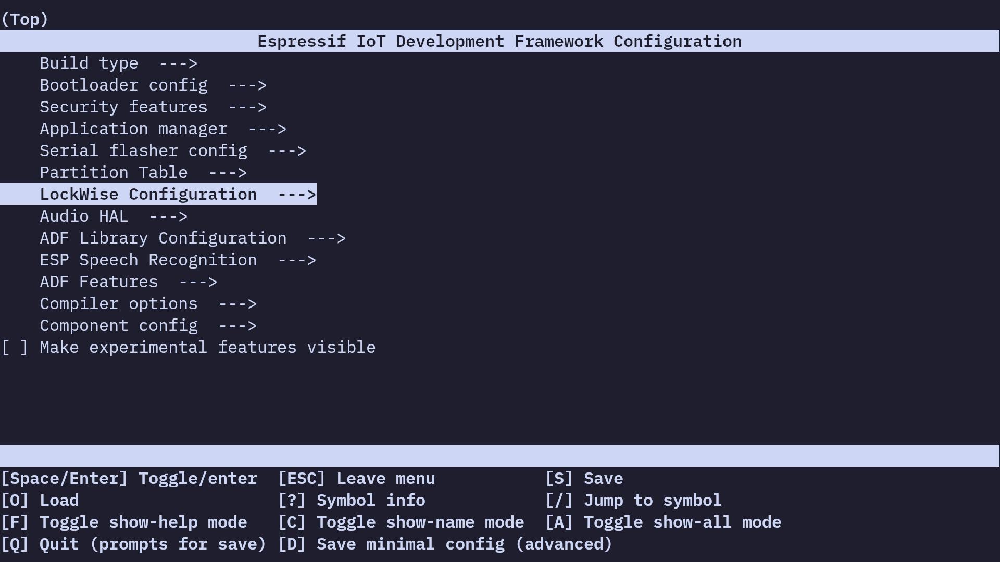
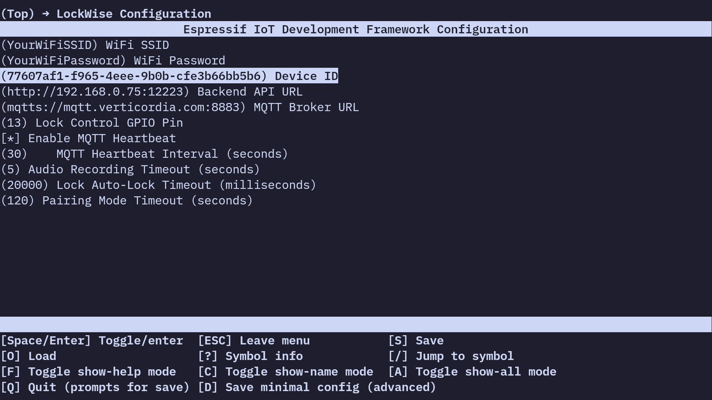

[← Anterior: História](História.md) | [Próximo: Back-end →](Backend.md)

# Desenvolvimento do Dispositivo

O firmware do LockWise roda no [ESP32-LyraT V4.3](https://docs.espressif.com/projects/esp-adf/en/latest/design-guide/dev-boards/get-started-esp32-lyrat.html), utilizando a framework [ESP-ADF](https://docs.espressif.com/projects/esp-adf/en/latest/)
para integração de áudio e conectividade. O código está organizado em múltiplos
arquivos C, cada um responsável por uma divisão específica do sistema.
Descreveremos cada módulo abaixo, destacando a função de inicialização.

## Componentes do Firmware

### Main

O arquivo principal `main.c` coordena a inicialização de todos os componentes,
configurando
[GPIO](https://docs.espressif.com/projects/esp-idf/en/latest/esp32/api-reference/peripherals/gpio.html),
[UART](https://docs.espressif.com/projects/esp-idf/en/latest/esp32/api-reference/peripherals/uart.html),
[NVS](https://docs.espressif.com/projects/esp-idf/en/latest/esp32/api-reference/storage/nvs_flash.html),
Wi-Fi, MQTT, áudio, sensores de toque e tarefas de monitoramento. Nesse arquivo,
se destaca a função principal de inicialização, que exibe as seguintes
mensagens na porta serial, e é explicada em detalhes abaixo:


```c
void app_main(void)
{
	// Set log level
	esp_log_level_set("*", ESP_LOG_WARN);
	esp_log_level_set(TAG, ESP_LOG_INFO);

	uint64_t pin_bit_mask; // GPIO bit mask
	pin_bit_mask = (1ULL << LOCK_INDICATOR_LED_GPIO); // Enable indicator LED

	// If an actual GPIO pin is set as the lock actuator, enable it too
	pin_bit_mask |= (LOCK_ACTUATOR_GPIO >= 0) ? (1ULL << LOCK_ACTUATOR_GPIO) : 0;

	// Apply configuration
	ESP_LOGI(TAG, "Setting up GPIO");
	gpio_config(&(gpio_config_t){ .pin_bit_mask = pin_bit_mask, .mode = GPIO_MODE_OUTPUT });

	// Ensure LED is off initially (not streaming)
	gpio_set_level(LOCK_INDICATOR_LED_GPIO, 0);

	// Initialize lock mutex and lock door
	lock_init();

	// ... (continua)
```

Inicializa *logging* para avisos para todos os componentes e informações para o
código do LockWise; inicializa *bitmask* de pinos de saída (atuadores),
definindo o LED indicador embutido e o pino que controla a relé da fechadura;
ao final, garante que a fechadura começa trancada.

```c
	// Start setup blink
	xTaskCreate(blink, "setup_blink", 1024, &(blink_params_t){ 400, 200 }, 1, &setup_blink_task);

	// Configure UART for serial input
	const uart_config_t uart_config = {
		.baud_rate = 115200,
		.data_bits = UART_DATA_8_BITS,
		.parity = UART_PARITY_DISABLE,
		.stop_bits = UART_STOP_BITS_1,
		.flow_ctrl = UART_HW_FLOWCTRL_DISABLE,
		.source_clk = UART_SCLK_APB,
	};
	ESP_LOGI(TAG, "Setting up UART driver");
	uart_param_config(UART_NUM_0, &uart_config);
	uart_driver_install(UART_NUM_0, 256, 0, 0, NULL, 0);

	puts("\n\n\033[3m\033[1m\033[96m=================   LockWise: Voice-Controlled Lock System   ==================\033[0m");

	// ... (continua)
```

Cria a tarefa inicial para indicar inicialização no LED, piscando com ativação
de 200ms e período de 400ms; inicializa porta UART para permitir depuração com
comandos de texto enviados pela porta serial; exibe *banner* indicando o início
da inicialização dos componentes.

```.c
	// Initialize NVS
	esp_err_t err = nvs_flash_init();
	if (err == ESP_ERR_NVS_NO_FREE_PAGES || err == ESP_ERR_NVS_NEW_VERSION_FOUND) {
		ESP_LOGE(TAG, "Non-volatile memory full. Flashing.");
		ESP_ERROR_CHECK(nvs_flash_erase());
		err = nvs_flash_init();
	}
	ESP_ERROR_CHECK(err);

	// Initialize network interface
#if (ESP_IDF_VERSION >= ESP_IDF_VERSION_VAL(4, 1, 0))
	ESP_ERROR_CHECK(esp_netif_init());
#else
	tcpip_adapter_init();
#endif

	// Load configuration
	load_config_from_nvs();

	// Start serial command task early to allow config updates before wifi connects
	xTaskCreate(serial_command_task, "serial_cmd", 4096, NULL, 4, NULL);

	// Initialize touch pad for Set (TOUCH_PAD_NUM9, IO32) and Play (TOUCH_PAD_NUM8, IO33)
	ESP_LOGI(TAG, "Setting up touch pads");
	touch_pad_init();
	touch_pad_set_voltage(TOUCH_HVOLT_2V7, TOUCH_LVOLT_0V5, TOUCH_HVOLT_ATTEN_1V);
	touch_pad_config(TOUCH_PAD_NUM9, 0);
	touch_pad_config(TOUCH_PAD_NUM8, 0);
	touch_pad_filter_start(10);
	xTaskCreate(touch_monitor_task, "touch_monitor", 4096, NULL, 4, NULL);

	// ... (continua)
```

Inicializa o armazenamento não-volátil, e deleta o que está contido se não
houver espaço; inicializa interface de rede dependendo da versão do ESP-IDF
usada; executa de forma síncrona o carregamento de todas as configurações
salvas; cria tarefa para aguardar comandos na porta serial, inicializada acima;
inicializa sensores capacitivos para poder controlar a fechadura localmente ou
entrar em modo de pareamento;

```c
	// Check if in pairing mode
	if (config.pairing_mode) {
		ESP_LOGI(TAG, "Device is in pairing mode, starting AP");

		// Immediately reset pairing mode so we don't get stuck
		update_config("pairing_mode", "0");
		puts("\n\033[3m\033[1m\033[91m---------------------------- Entering Pairing Mode ----------------------------\033[0m");

		// Start pairing blink
		vTaskDelete(setup_blink_task);
		xTaskCreate(blink, "pairing_blink", 1024, &(blink_params_t){ 1000, 10 }, 1, NULL);

		// Start pairing server
		start_pairing_server();

		// Should not reach here
		ESP_LOGE(TAG, "Servidor de pareamento terminou!");
		esp_sleep_disable_wakeup_source(ESP_SLEEP_WAKEUP_ALL);
		esp_deep_sleep_start();
	}

	// ... (continua)

```

Se o dispositivo foi iniciado em modo de pareamento, exibe o aviso; restaura
configuração de pareamento na memória não-volátil, para garantir que não fique
preso em ciclo de reinicializações em modo de pareamento caso algo dê errado;
interrompe tarefa que pisca LED em modo de *setup*; cria uma nova tarefa para
piscar o LED por 10ms com intervalo de 1000ms; inicia o ponto de acesso de
paremaneto, que nunca deve retornar; e, caso retorne, exibe um erro e entra em
sono profundo.

```c
	// Initialize WiFi (station mode)
	wifi_init();

	// Initialize audio board after WiFi to avoid ISR conflicts
	ESP_LOGI(TAG, "Setting up audio board");
	g_board_handle = audio_calloc(1, sizeof(struct audio_board_handle));
	AUDIO_MEM_CHECK(TAG, g_board_handle, return);
	audio_hal_codec_config_t cfg = AUDIO_CODEC_DEFAULT_CONFIG();
	cfg.adc_input = AUDIO_HAL_ADC_INPUT_LINE1; // Should be LINE2 for AUX_IN
	g_board_handle->audio_hal = audio_hal_init(&cfg, &AUDIO_CODEC_ES8388_DEFAULT_HANDLE);
	AUDIO_NULL_CHECK(TAG, g_board_handle->audio_hal, return);

	// Get I²C handle
	g_i2c_handle = i2c_bus_get_master_handle(I2C_NUM_0);

	// Initialize system clock
	esp_sntp_config_t ntp_config = ESP_NETIF_SNTP_DEFAULT_CONFIG("pool.ntp.org");
	ESP_LOGI(TAG, "Initializing system clock via SNTP: %s", *ntp_config.servers);
	esp_netif_sntp_init(&ntp_config);

	// Change blink for SNTP sync wait
	vTaskDelete(setup_blink_task);
	xTaskCreate(blink, "setup_blink", 1024, &(blink_params_t){ 200, 100 }, 1, &setup_blink_task);

	if (esp_netif_sntp_sync_wait(pdMS_TO_TICKS(15000)) != ESP_OK)
		ESP_LOGE(TAG, "Failed to update system time within 15s timeout");

	// ... (continua)
```

Caso não estejamos em modo de pareamento, inicia módulo Wi-Fi em modo de
estação (e não ponto de acesso); inicializa *manualmente* a placa de áudio para
permitir customizar qual linha será direcionada ao codec ES8388; obtém uma
*handle* global para o barramento I²C; inicializa o relógio de sistema com o
horário da rede, aguardando até 15 segundos para que isso aconteça, enquanto
pisca rapidamente o LED interno (período de 200ms com ativação de 100ms).

```c
	// Stop setup blink
	if (setup_blink_task) {
		vTaskDelete(setup_blink_task);
		setup_blink_task = NULL;
		gpio_set_level(LOCK_INDICATOR_LED_GPIO, 0);
	}
	gpio_set_level(LOCK_INDICATOR_LED_GPIO, 1); // Indicate that MQTT is starting

	// Initialize MQTT
	mqtt_init();

	// Initialize audio stream only if voice detection is enabled
	if (config.voice_detection_enable)
		audio_stream_init();

	// Start MQTT heartbeat task
	if (config.mqtt_heartbeat_enable)
		xTaskCreate(mqtt_heartbeat_task, "mqtt_heartbeat", 4096, NULL, 3, &heartbeat_task);

	ESP_LOGD(TAG, "Starting I²C scan…");
	for (uint8_t addr = 1; addr < 127; ++addr)
		if (i2c_master_probe(g_i2c_handle, addr, 100) == ESP_OK)
			ESP_LOGD(TAG, "Found device at %02X", addr);
	ESP_LOGD(TAG, "I²C scan complete!");

	puts("\033[3m\033[1m\033[96m--------------------------- Initialization Complete ---------------------------\033[0m\n");

	// Main loop
	for (;;)
		vTaskDelay(pdMS_TO_TICKS(1000));
}
```

Para a tarefa de piscar rapidamente e mantém o LED continuamente aceso para
indicar que estamos nos conectando ao *broker* MQTT; inicializa o módulo MQTT;
ativa a tarefa de detecção de voz ativada por ruído, se habilitada; ativa a
tarefa de *heartbeat* com as configurações enviadas ao *back-end* via MQTT
periodicamente, se habilitada; exibe todos os dispositivos conectados ao
barramento I²C, para depuração; indica fim da inicialização; e entra em loop
infinito enquanto as outras tarefas executam.

### Config

Complementando a inicialização, `config.c` gerencia o armazenamento persistente
de configurações no sistema
[NVS](https://docs.espressif.com/projects/esp-idf/en/latest/esp32/api-reference/storage/nvs_flash.html)
do ESP32, permitindo que parâmetros como credenciais Wi-Fi, URLs de back-end e
thresholds de áudio sejam salvos e recuperados entre reinicializações. O
cabeçalho possui um *singleton* (instanciado com `config_t config` na unidade
de translação em si) com as configurações:

```c
typedef struct {
	char wifi_ssid[32]; /**< Nome da rede Wi-Fi para conexão */
	char wifi_password[64]; /**< Senha da rede Wi-Fi */
	char device_id[64]; /**< Identificador único do dispositivo (UUID) */
	char backend_url[256]; /**< URL da API do back-end para streaming de voz */
	char backend_bearer_token[256]; /**< Token de autenticação Bearer para a API do back-end */
	char mqtt_broker_url[256]; /**< URL do broker MQTT para comunicação */
	char mqtt_broker_password[256]; /**< Senha para autenticação no broker MQTT */
	bool mqtt_heartbeat_enable; /**< Habilita/desabilita o heartbeat MQTT periódico */
	int mqtt_heartbeat_interval_sec; /**< Intervalo em segundos entre heartbeats MQTT */
	int audio_record_timeout_sec; /**< Tempo limite para gravação de áudio em segundos */
	int lock_timeout_ms; /**< Tempo para trancamento automático da fechadura em ms */
	int pairing_timeout_sec; /**< Tempo limite para o modo de pareamento em segundos */
	char user_id[256]; /**< ID do usuário pareado */
	bool pairing_mode; /**< Indica se o dispositivo está em modo de pareamento */
	bool voice_detection_enable; /**< Habilita/desabilita detecção de voz */
	int vad_rms_threshold; /**< Limiar RMS para detecção de atividade de voz */
} config_t;

extern config_t config;
```

Além disso, conta com duas funções: uma `load_config_from_nvs()` para carregar
os valores inicialmente armazenados em memória não-volátil ou preencher os
valores padrão caso não existam, e outra `update_config()` para atualizar a
configuração atual e salvá-la de volta na memória não-volátil, após validá-la.
Essa segunda função é chamada pelos *callbacks* em `mqtt.c` e, em caso de
depuração por meio da porta UART, em `serial.c`.

### Audio Stream

O processamento de áudio é tratado por `audio_stream.c`, que implementa captura
de voz em tempo real via [I²S](https://en.wikipedia.org/wiki/I%C2%B2S),
detecção de atividade vocal (VAD) e transmissão de dados para o back-end Rocket
para autenticação. Este módulo faz uso extensivo das APIs do ESP-ADF para
otimizar o uso de recursos limitados do microcontrolador. Inclui uma função
para inicialização em `audio_stream_init()` que inicia a pipeline com o método
interno `audio_init_pipeline()` e cria três tarefas assíncronas: `vad_task()`
para detectar atividade vocal, `http_stream_task()` para fazer upload das
amostras de áudio detectadas para o *back-end*, e `audio_stream_task()` que
coordena as outras duas, processando comandos da fila de eventos para iniciar
ou parar streaming de áudio baseado na atividade vocal e no *timeout*
configurado.

### Wi-Fi

A conectividade de rede é gerenciada por `wifi.c`, responsável por estabelecer
conexões Wi-Fi em modo estação e modo ponto de acesso para configuração
inicial, incluindo um servidor HTTP temporário para pareamento com o aplicativo
móvel. Inclui um inicializador para o modo de operação normal com
`wifi_init()`, e outro para inicialização em modo de pareamento com
`wifi_init_ap()` — note que essas funções usam APIs distintas, e cada uma opera
num nível de abstração diferente; elas são completamente incompatíveis entre
si, e é  por isso que separamos o modo normal do modo de pareamento por uma
reinicialização forçada. Inclui uma tarefa assíncrona `timeout_task()` para
cancelar o pareamento se o *timeout* configurado for alcançado, um *callback*
`ip_event_handler()` para responder quando obtivermos um IP da rede, um
*callback* `handle_pairing_client()` que será executado quando um dispositivo
móvel tentar parear conosco, e outros métodos auxiliares.

### MQTT

Para comunicação em tempo real, `mqtt.c` implementa o protocolo
[MQTT](https://mqtt.org/) usando o cliente ESP-IDF, publicando status do
dispositivo e se inscrevendo para receber comandos remotos, utilizando
[CBOR](https://cbor.io/) para serialização eficiente de mensagens para
possibilitar controle remoto instantâneo e monitoramento contínuo do estado da
fechadura. Inclui inicialização via `mqtt_init()` que registra o *handler*
`mqtt_event_handler()`, decodifica mensagens recebidas com
`process_cbor_command()`, e disponibiliza várias funções para publicar
diferentes tipos de mensagens ao broker, com `mqtt_publish_status()`,
`mqtt_publish_lock_event()`, e `mqtt_publish_heartbeat()`, além de habilitar
publicação periódica das configurações e estado da fechadura por meio da tarefa
assíncrona `mqtt_heartbeat_task()`.

### Lock

O controle físico da fechadura é realizado por `lock.c`, que gerencia o atuador
GPIO com sincronização via *Mutexes* do
[FreeRTOS](https://www.freertos.org/), o que permite implementar *timeouts*
de autotrancamento sem condições de corrida ou *deadlocks*. Inclui um *singleton*
para manter o contexto do atuador mecânico e impedir acessos simultâneos:

```c
typedef struct {
	lock_state_t state; /**< Estado atual da fechadura */
	SemaphoreHandle_t mutex; /**< Mutex para proteger acesso ao contexto */
	TimerHandle_t timer; /**< Timer para trancamento automático */
} lock_context_t;

static lock_context_t lock_ctx;
```

Conta com três funções para controle: `lock_door()`, `unlock_door()`, e
`toggle_door()`. Também providencia inicialização via `lock_init()` e controle
do LED integrado com a função `blink()`, usada por vários módulos para indicar
*status* de operação.

### Serial

Para depuração e manutenção, `serial.c` fornece uma interface de comandos via
UART, permitindo atualização de configurações e teste de funcionalidades sem
necessidade de recompilação. Consiste em única função pública,
`serial_command_task()`, que recebe caracteres na porta serial e interpreta
comandos a serem executados.

### System Utils

Finalmente, `system_utils.c` contém funções para reinicialização ou habilitação
do modo de bloqueio (*lockdown*) de emergência, e faz isso de forma organizada
e com *logging* via MQTT, para que o estado da fechadura seja corretamente
refletido no aplicativo.

## Componentes Externos e Configuração

Os componentes externos utilizados são definidos no arquivo `CMakeLists.txt`,
na pasta `main/`. Abaixo, vemos inclusas nossas unidades de translação do
projeto, e no `REQUIRE` nós definimos todos os componentes do ESP-IDF que nos
serão necessários:

```cmake
idf_component_register(SRCS
	"src/audio_stream.c"
	"src/config.c"
	"src/lock.c"
	"src/main.c"
	"src/mqtt.c"
	"src/serial.c"
	"src/system_utils.c"
	"src/wifi.c"
	INCLUDE_DIRS "include"
	REQUIRES mqtt esp_peripherals audio_pipeline esp_http_client driver audio_stream mbedtls esp_netif)
```

A tabela de partições do dispositivo foi definida em `partitions.csv` da
seguinte maneira:

  | Name     | Type | SubType | Offset   | Size     | Flags |
  | -------- | ---- | ------- | -------- | -------- | ----- |
  | nvs      | data | nvs     | 0x9000   | 0x4000   |       |
  | otadata  | data | ota     | 0xd000   | 0x2000   |       |
  | phy_init | data | phy     | 0xf000   | 0x1000   |       |
  | factory  | app  | factory | 0x10000  | 0x1B0000 |       |
  | storage  | data | fat     | 0x1C0000 | 0x30000  |       |

As configurações particulares para provisionar um dispositivo individual são
acessadas por meio do comando `menuconfig` do script auxiliar:




Os padrões estão definidos num arquivo `sdkconfig.defaults`, e estão otimizados
para usar menos memória DRAM e permitir uso de TLS onde possível:

```conf
# ESP32-LyraT V4.3 Configuration
CONFIG_ESP_DEFAULT_CPU_FREQ_MHZ_240=y

# Flash Configuration
CONFIG_ESPTOOLPY_FLASHSIZE_4MB=y
CONFIG_ESPTOOLPY_FLASHSIZE="4MB"

# Audio HAL Configuration
CONFIG_ESP_LYRAT_V4_3_BOARD=y

# FreeRTOS Configuration
CONFIG_FREERTOS_HZ=1000
CONFIG_FREERTOS_TIMER_TASK_STACK_DEPTH=3072
CONFIG_FREERTOS_ENABLE_BACKWARD_COMPATIBILITY=y

# WiFi Configuration
CONFIG_ESP_WIFI_DYNAMIC_TX_BUFFER_NUM=32
CONFIG_ESP_WIFI_STATIC_RX_BUFFER_NUM=16
CONFIG_ESP_WIFI_DYNAMIC_RX_BUFFER_NUM=32

# MQTT Configuration
CONFIG_MQTT_PROTOCOL_311=y
CONFIG_MQTT_TRANSPORT_SSL=y
CONFIG_MQTT_TRANSPORT_WEBSOCKET=n

# HTTP Client Configuration
CONFIG_ESP_HTTP_CLIENT_ENABLE_HTTPS=y

# NVS Configuration
CONFIG_NVS_ENCRYPTION=n

# Partition Table
CONFIG_PARTITION_TABLE_CUSTOM=y
CONFIG_PARTITION_TABLE_CUSTOM_FILENAME="partitions.csv"
CONFIG_PARTITION_TABLE_FILENAME="partitions.csv"

# Memory
CONFIG_SPIRAM=y
CONFIG_SPIRAM_SPEED_80M=y
CONFIG_SPIRAM_USE_MALLOC=y
CONFIG_SPIRAM_MEMTEST=n

# Task WDT
CONFIG_ESP_TASK_WDT_TIMEOUT_S=10

# Log level
CONFIG_LOG_DEFAULT_LEVEL_INFO=y

# Disable unused ADF components to save memory
CONFIG_AUDIO_RECORDER_ENABLED=n
CONFIG_DISPLAY_SERVICE_ENABLED=n
CONFIG_BLUETOOTH_SERVICE_ENABLED=n
CONFIG_INPUT_KEY_SERVICE_ENABLED=n
CONFIG_BATTERY_SERVICE_ENABLED=n
CONFIG_CLOUD_SERVICE_ENABLED=n
CONFIG_WIFI_SERVICE_ENABLED=n
CONFIG_OTA_SERVICE_ENABLED=n

# Allow mbedTLS to allocate on SPIRAM, which releases a bunch of pages
CONFIG_MBEDTLS_INTERNAL_MEM_ALLOC=n
CONFIG_MBEDTLS_EXTERNAL_MEM_ALLOC=y
CONFIG_MBEDTLS_DEFAULT_MEM_ALLOC=n
CONFIG_MBEDTLS_CUSTOM_MEM_ALLOC=n
```

[← Anterior: História](História.md) | [Próximo: Back-end →](Backend.md)
